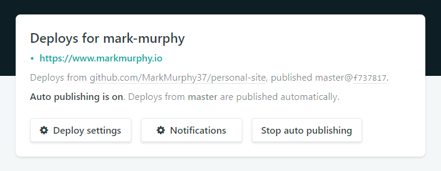

Hi there!👋🏼 Welcome to MarkMurphy.io!

MarkMurphy.io is my personal site built with GatsbyJS, ReactJS, GraphQL, and hosted on Netlify. So why GatsbyJS? I've been wanting to experiment with the [JAM stack](https://jamstack.org/) for some time as well as learn more about [GraphQL](https://graphql.org/). After some quick Googling, GatsbyJS seemed like the perfect opportunity to do both.

So what is [GatsbyJS](https://www.gatsbyjs.org/)? Simply put, Gatsby is a static site generator. It allows you to leverage some of the web's most powerful tools including ReactJS, Webpack, GraphQL and more, but without a lot of the setup and fuss. Seriously though. You can get up and running with just four commands:

### **Install Gatsby's command line tool**

`npm install --global gatsby-cli`

### **Use the Gatsby CLI to create a new site.**

`gatsby new gatsby-site`

### **Change directories into site folder.**

`cd gatsby-site`

### **Start development server.**

`gatsby develop`

Just like that you can start experimenting with some of the web's most powerful technologies. How cool is that? Oh and did I mention Gatsby is fast? 🔥🔥🔥

As I started to build my site, I really wanted it to be fast, accessible, and SEO friendly. If do you things right with Gatsby, your site will be all three. Just check out the Lighthouse audit scores for the [MarkMurphy.io](http://markmurphy.io) home page: 👇🏼

Not too shabby. (Although my competitive side wants to get everything to 100 so stay tuned!) 

Why is Gatsby so fast? Gatsby makes performance optimizations automatically out-of-the-box. Some of these optimizations include: prefetching soon-to-be-needed resources, inlining critical CSS, per route code/data splitting, and more. The bottom line is that Gatsby makes it really really hard to build a slow site, which great for your users, SEO and your sanity.

Speaking of things great for your sanity, Gatsby makes it easy to load data from anywhere, whether that data is from a headless CMS like WordPress, a REST API, or even markdown files. Since I utilize the productivity tool [Notion](https://www.notion.so/) for host of things including writing, I chose to drive my blog using markdown files.

Notion allows me to export whatever I write as a markdown file, which I can then easily add as a .md file to my site. Once added, a blog post page and route will get generated automatically based on my Gatsby site configuration. 👌🏼 Another automated process I leverage for my Gatsby site is Netlify deploy.

Since Gatsby is a static site generator, hosting the site is super affordable and if you use [Netlify](https://www.netlify.com/), it can be free. 🤑 Connecting a repository (in my case [GitHub](https://github.com/MarkMurphy37/personal-site)) to Netlify is pretty straightforward. 

Once connected, you can have Netlify watch a branch of your repo for changes as well as execute builds commands when changes are detected. I've configured Netlify to watch the master branch of my GitHub repo. Any time new changes are pushed to the master branch, Netlify executes predefined build commands and deploys a new version the site automatically. 🙌🏼 Not bad for a site hosted for free.

All in all, I'm a big fan of Gatsby so far. The ease of use, performance, and affordable hosting make for a great development experience. Consider trying out Gatsby for your next project and let me know what you think!
